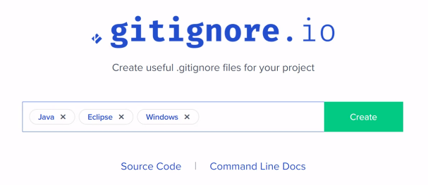
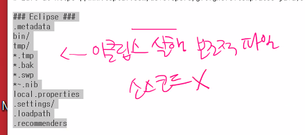
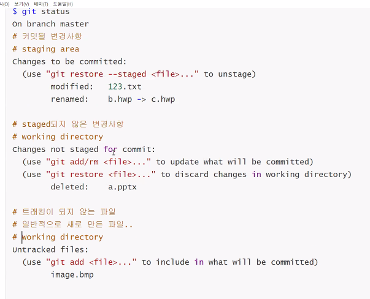

## gitignore

> 파일에 대한 중요성이 있기 때문에 [깃아! 이것을 무시해줘]
>
> ```bash
> data.csv  #특정 파일
> secret    #특정 폴더
> .pptx     #특정 확장자
> ```


1. 기본

* .gitignore를 생성한다.
* 파일안에 무시해야할 파일을 입력해준다.


2. Eclipse / Java / Python ….. 와 같은 개발환경

[참고링크](http://gitignore.io/)





* 다양한 환경에 대해 무시해야할 사항을 지정해준다.(홈페이지)


## git 상태




# git 편집기를 vs code로 바꾸기

* git bash에서 기본 편집기는 `vim`
  * 초보자가 사용하기 불편
* 편집기 설정을 아래와 같이 한다면, visual studio code로 사용할 수 있다.

```bash
$ git config --global core.editor "code --wait"
```

* 설정된 옵션을 보기 위해서는 아래의 명령어를 활용한다.

```bash
$ git config --global -l #1이 아니라 L이다.

filter.lfs.clean=git-lfs clean -- %f
filter.lfs.smudge=git-lfs smudge -- %f
filter.lfs.process=git-lfs filter-process
filter.lfs.required=true
user.name=HeoJinYong
user.email=qwerm792@gmail.com
core.editor=code --wait #여기 설정!
```

