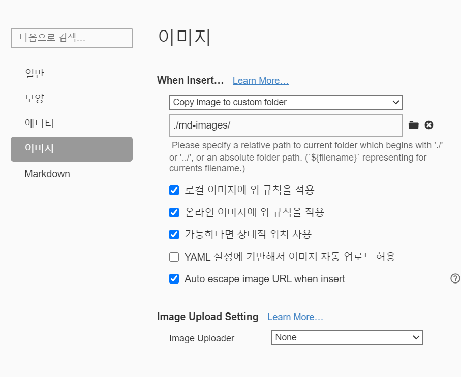

# markdown 문법

## 제목(heading)

#의 갯수를 바탕으로 제목의 레벨을 지정한다.

## 목록

* 순서가 없는
* 목록 
  * (tab 하위레벨 / shift+tab 상위레벨)

1. 순서가 있는
2. 목록
   1. (tab 하위레벨 / shift+tab 상위레벨)

## 코드 블럭

```java
System.out.println("hi");
// comment
```

```python
print("hi")
# comment
// not comment
```

```html
<h1>
    제목
</h1>
<!-- comment -->
```


## 인용문

* <를 통해 인용문 표시


## 표

| 순번 | 이름   | 비고 |
| ---- | ------ | ---- |
| 1    | 홍길동 |      |
| 2    | 이순신 |      |
| 3    | 강감찬 |      |

## 이미지




* typora에서 위의 설정을 하면, 상대경로로 이미지가 관리 된다.

## 링크

[]로 단어를 감싸고 ()로 링크를 달아준다.

ex : [구글](https://google.com)에서 검색을 하자!

## 기타

*기울임*

*기울기

**굵게**

**굵게

~~취소선~~

~~:취소선

---

--- : 수평선